# A1-1\_Prompt\_Manager

## 🗂️ 나만의 프롬프트 관리 프로그램

Python 콘솔에서 프롬프트를 **등록 · 분류 · 검색 · 상세 조회 · 즐겨찾기 관리**할 수 있도록 만든 프로그램입니다.

기본 과제 기능을 구현한 뒤 **보너스 과제 1**까지 확장하여 다음 기능을 추가했습니다.

# 1. 프로젝트 한눈에 보기

| 항목      | 구현 내용                                                                 |
| ------- | --------------------------------------------------------------------- |
| 개발 언어   | Python 3.10 이상                                                        |
| 프로그램 형태 | 콘솔 기반 프로그램                                                            |
| 데이터 구조  | `list` + `dict`                                                       |
| 기본 기능   | 추가, 목록, 카테고리 조회, 검색, 상세 보기, 즐겨찾기                                      |
| 입력 검증   | 빈 값, 숫자 여부, 번호 범위 검사                                                  |
| 데이터 유지  | JSON 저장 / 불러오기                                                        |
| 내보내기    | Markdown 파일 생성                                                        |
| Git     | `init`, `add`, `commit`, `push`, `pull`, `checkout`, `clone`, `merge` |
| 브랜치     | `feature/list`에서 목록 기능 구현 후 `main` 병합                                 |
| GitHub  | <https://github.com/lgd12345/A1-1_Prompt_Manager>                     |

> ### ⭐ 보너스 과제 1 수행
>
> | 구현 항목          | 구현 내용                                                  |
> | -------------- | ------------------------------------------------------ |
> | JSON 저장 / 불러오기 | `prompts.json`에 프롬프트와 즐겨찾기 상태를 저장하여 프로그램 종료 후에도 데이터 유지 |
> | Markdown 내보내기  | 전체 프롬프트를 카테고리별로 정리하여 `exports/prompts_export.md` 생성    |
>
> 기본 과제의 **실행 중 데이터 관리**에서 더 나아가 **데이터 영속화와 문서 내보내기**까지 구현했습니다.
>
> ​

# 2. 프로젝트 목표

프롬프트가 많아지면 메모장이나 여러 문서에 흩어진 내용을 다시 찾기 어려워집니다.

이 프로젝트에서는 프롬프트를 한곳에서 관리하면서 Python의 기초 문법과 Git의 버전 관리 흐름을 실제 프로그램 안에서 연결하는 것을 목표로 했습니다.

### Python 목표

* 리스트와 딕셔너리를 이용한 데이터 관리

* 조건문과 반복문을 이용한 메뉴 처리

* 기능별 함수 분리

* 사용자 입력 검증

* 제목/내용 기반 검색

* JSON 파일 입출력

* Markdown 파일 생성

### Git / GitHub 목표

* 기능 단위 커밋

* 별도 브랜치에서 기능 개발

* `checkout`을 이용한 브랜치 전환

* `merge`를 이용한 병합

* `push`, `pull`, `clone` 사용

* GitHub 원격 저장소에서 변경 이력 관리

​

# 3. 개발 환경 및 초기 설정

* Python 3.10 이상

* Git / GitHub

* Visual Studio Code

* 외부 라이브러리 없이 Python 기본 라이브러리만 사용

* 사용 모듈: `json`, `os`

## 3.1 Python / Git / VSCode 버전 확인

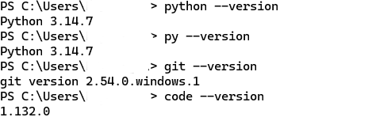

## 3.2 Git 사용자 정보 및 Python 실행 확인

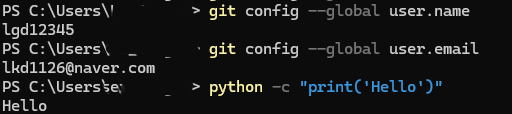

Git 사용자 이름과 이메일을 설정하고 Python 코드가 정상 실행되는 것을 확인했습니다.

## 3.3 VSCode Python 확장 확인

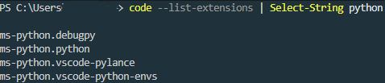

​

# 4. GitHub 및 Git 작업 과정

## 4.1 GitHub 저장소 생성

GitHub에 `A1-1_Prompt_Manager` 저장소를 생성했습니다.

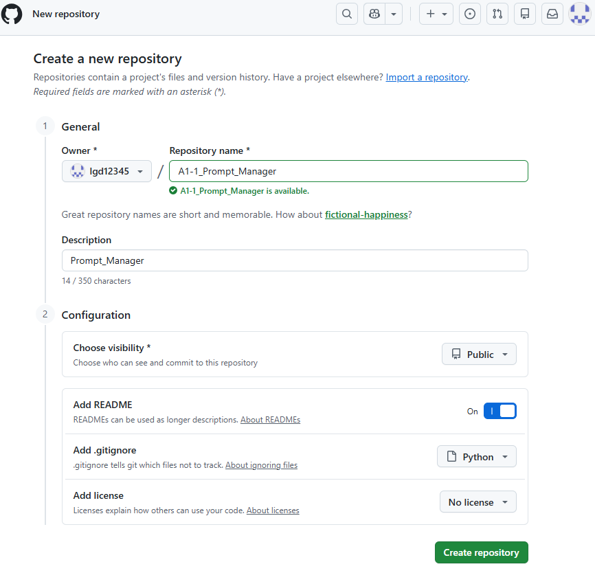

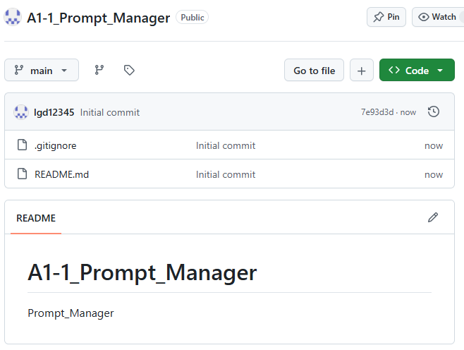

**Repository**

<https://github.com/lgd12345/A1-1_Prompt_Manager>

​

## 4.2 clone

원격 저장소를 로컬에 복제하는 `git clone`을 직접 실행했습니다.

```bash
git clone <저장소 URL>
```

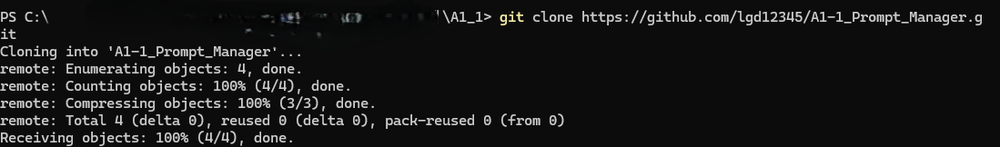

​

## 4.3 add / commit / push

기능 구현 후 변경된 파일을 스테이징하고 커밋한 뒤 GitHub에 업로드했습니다.

```bash
git add .
git commit -m "커밋 메시지"
git push
```

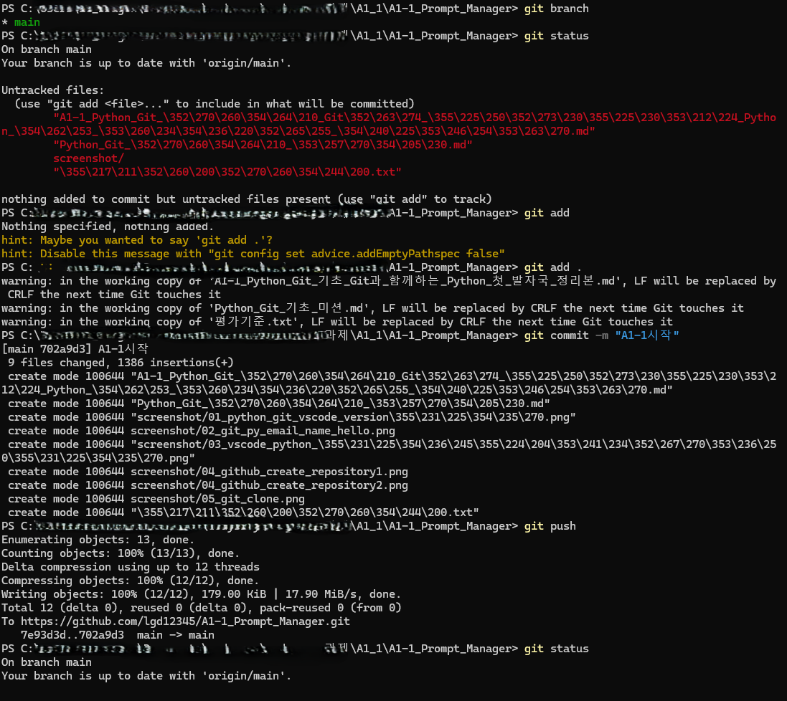

​

## 4.4 git init

로컬 프로젝트를 Git 저장소로 초기화하는 과정도 확인했습니다.

```bash
git init
```

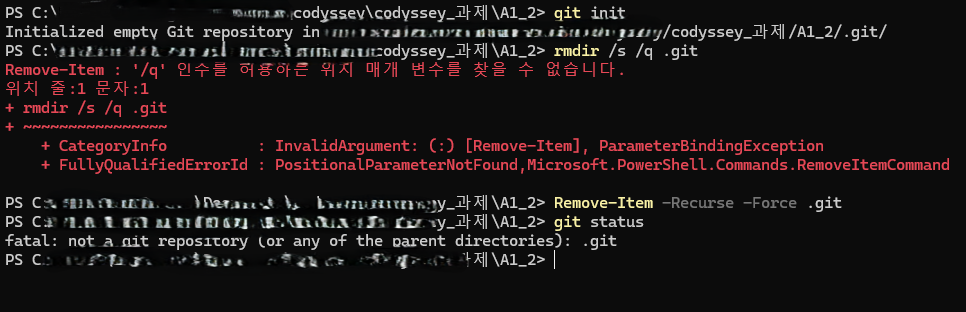

​

## 4.5 pull

원격 저장소와 로컬 저장소를 동기화하기 위해 `git pull`을 실행했습니다.

```bash
git pull
```

당시 로컬과 원격이 이미 같은 상태였기 때문에 `Already up to date.`가 출력되었습니다.

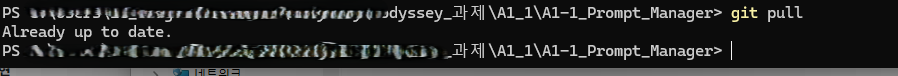

​

# 5. 브랜치 작업과 병합

프롬프트 목록 기능은 `main`에서 바로 구현하지 않고 **feature/list브랜치에서 별도로 개발**했습니다.

## 5.1 브랜치 생성 및 checkout

```bash
git checkout -b feature/list
```

`git branch`로 현재 작업 브랜치가 `feature/list`인지 확인했습니다.

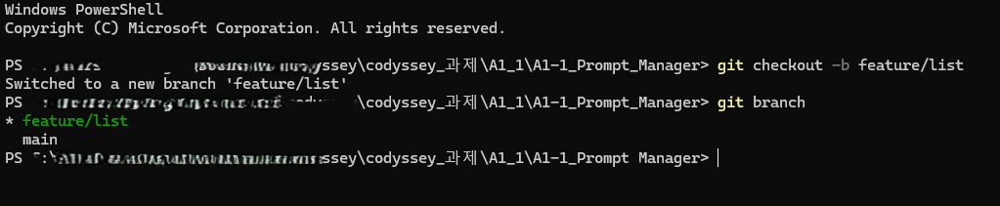

### 브랜치를 분리한 이유

목록 기능을 다른 기능과 분리하여 작업하면 해당 기능의 변경 사항을 독립적으로 관리할 수 있습니다.

이번 프로젝트에서는 다음을 기준으로 병합했습니다.

1. `feature/list`에서 목록 기능 구현

2. 기능 실행 확인

3. 기능 단위 커밋

4. `main`으로 이동

5. 정상 구현된 기능을 `main`에 병합

```bash
git checkout main
git merge feature/list
```

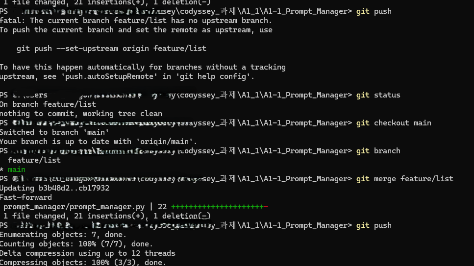

​

## 5.2 Fast-forward merge란?

이번 병합에서는 `Fast-forward`가 발생했습니다.

브랜치를 만든 이후 `main`에는 새로운 커밋이 없었고 `feature/list`에만 새로운 커밋이 추가되어 있었습니다.

### 병합 전

```text
A ─ B ─ C  ← main
         \
          D  ← feature/list
```

### 병합 후

```text
A ─ B ─ C ─ D
              ↑
       main, feature/list
```

Git이 별도의 merge commit을 만들지 않고 **main브랜치 포인터를feature/list의 최신 커밋까지 앞으로 이동**시킨 것입니다.

따라서 최종 Git 그래프는 분기선이 크게 보이지 않고 일직선 형태로 나타나지만, `feature/list`에서 목록 기능을 개발한 뒤 `merge`한 과정은 정상적으로 수행했습니다.

​

## 5.3 최종 Git 로그

```bash
git log --oneline --graph
```

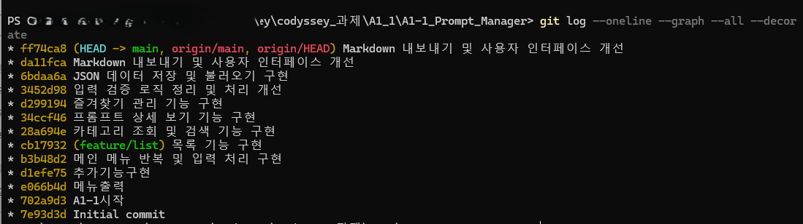

기능별 커밋을 나누어 변경 이력을 관리했습니다.

### 커밋을 기능 단위로 나눈 기준

커밋 하나가 가능한 한 **하나의 의미 있는 기능 또는 하나의 개선 목적**을 가지도록 나눴습니다.

개발 흐름은 다음과 같습니다.

```text
기본 프롬프트 데이터 / 메뉴
        ↓
프롬프트 추가
        ↓
메뉴 및 입력 처리
        ↓
feature/list에서 목록 기능
        ↓
카테고리 조회 / 검색
        ↓
상세 보기
        ↓
즐겨찾기
        ↓
입력 검증 / 코드 정리
        ↓
JSON 저장 / 불러오기
        ↓
Markdown 내보내기 / UI 개선
```

이렇게 나누면 문제가 발생했을 때 어떤 기능에서 변경이 생겼는지 커밋 기록으로 확인하기 쉽습니다.

​

# 6. 프로그램 실행

프로그램 파일은 저장소 루트의 `prompt_manager/` 폴더 안에 있습니다.

저장소를 연 뒤 다음과 같이 프로그램 폴더로 이동해서 실행합니다.

```bash
cd prompt_manager
python prompt_manager.py
```

환경에 따라 다음 명령어를 사용할 수도 있습니다.

```bash
cd prompt_manager
python3 prompt_manager.py
```

`prompts.json`과 `exports/` 경로가 프로그램 실행 위치를 기준으로 사용되므로, `prompt_manager/` 폴더에서 실행하는 방식으로 정리했습니다.

## 메인 화면

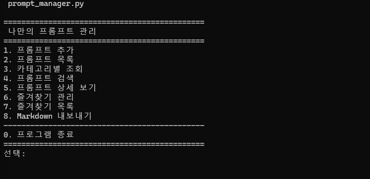

```text
=============================================
 나만의 프롬프트 관리
=============================================
1. 프롬프트 추가
2. 프롬프트 목록
3. 카테고리별 조회
4. 프롬프트 검색
5. 프롬프트 상세 보기
6. 즐겨찾기 관리
7. 즐겨찾기 목록
8. Markdown 내보내기
---------------------------------------------
0. 프로그램 종료
=============================================
```

​

# 7. 주요 기능

## 7.1 프롬프트 추가

새 프롬프트의 다음 정보를 입력합니다.

* 제목

* 내용

* 카테고리

카테고리는 기본 목록에서 선택하거나 `직접 입력`으로 새로운 카테고리를 만들 수 있습니다.

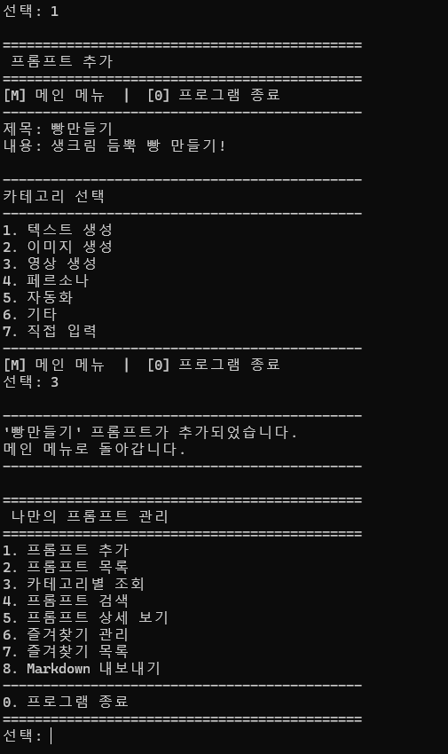

### 입력 중 이동

```text
[M] 메인 메뉴  |  [0] 프로그램 종료
```

추가 작업 도중 `M`을 입력하면 메인 메뉴로 돌아가고 `0`을 입력하면 프로그램을 종료합니다.

프롬프트가 정상적으로 추가되면 별도의 추가 입력 없이 자동으로 메인 메뉴로 돌아갑니다.

​

## 7.2 전체 프롬프트 목록

등록된 프롬프트를 번호, 카테고리, 제목, 즐겨찾기 상태와 함께 출력합니다.

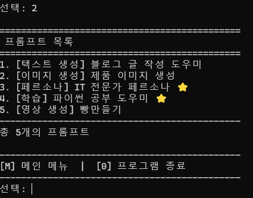

​

## 7.3 카테고리별 조회

선택한 카테고리에 해당하는 프롬프트만 출력합니다.

사용자가 `직접 입력`으로 추가한 카테고리도 조회 대상에 자동으로 포함됩니다.

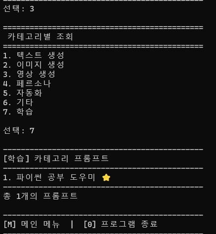

​

## 7.4 키워드 검색

검색어가 **제목 또는 내용**에 포함되어 있으면 검색 결과에 추가합니다.

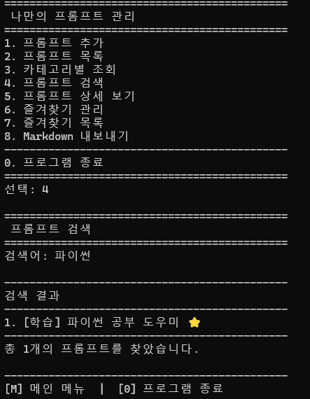

실제 구현의 핵심 부분은 다음과 같습니다.

```python
keyword_lower = keyword.lower()

for prompt in prompts:
    if (
        keyword_lower in prompt["title"].lower()
        or keyword_lower in prompt["content"].lower()
    ):
        results.append(prompt)
```

### 구현 원리

* `in` 연산자로 문자열 포함 여부 확인

* `or`를 사용하여 제목과 내용 중 하나만 일치해도 검색

* `.lower()`를 사용하여 영문 검색 시 대소문자 차이를 줄임

​

## 7.5 상세 보기

프롬프트 번호를 선택하면 다음 내용을 출력합니다.

* 제목

* 카테고리

* 즐겨찾기 상태

* 전체 내용

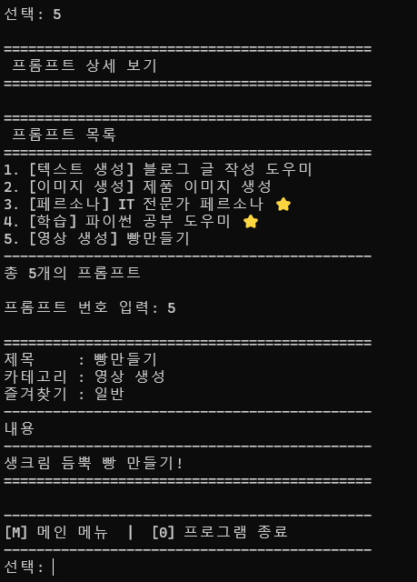

​

## 7.6 즐겨찾기

프롬프트의 `favorite` 값을 반대로 변경하는 방식으로 추가/해제를 하나의 기능에서 처리합니다.

```python
prompt["favorite"] = not prompt["favorite"]
```

```text
False → True
True → False
```

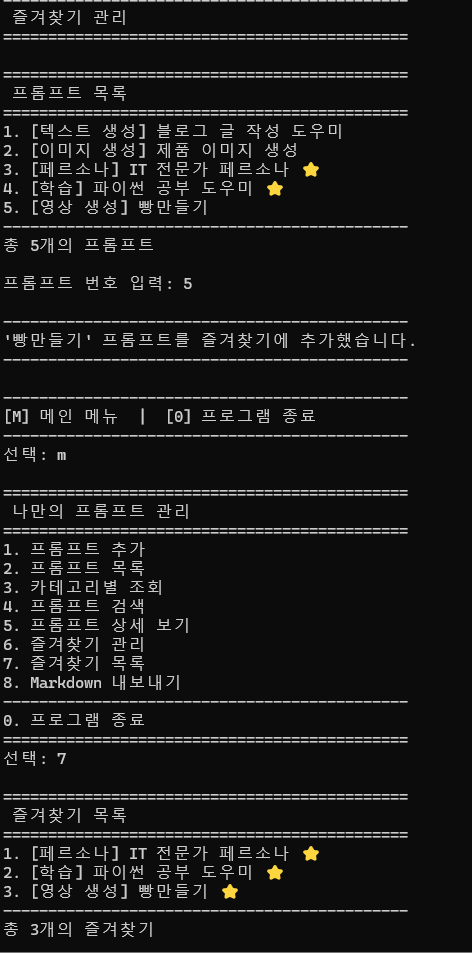

변경 직후 `save_prompts()`를 실행하기 때문에 즐겨찾기 상태도 JSON에 저장됩니다.

​

## 7.7 프로그램 종료

기능 실행 후에는 다음 메뉴를 표시합니다.

```text
[M] 메인 메뉴  |  [0] 프로그램 종료
```

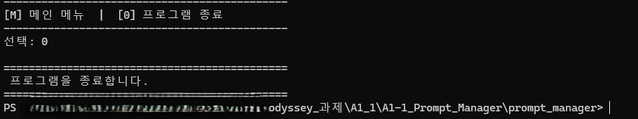

`0`을 선택하면 데이터를 저장한 뒤 프로그램을 종료합니다.

​

# 8. 데이터 구조와 선택 이유

프롬프트 데이터는 **리스트 안에 딕셔너리를 저장**하는 방식으로 관리합니다.

```python
prompts = [
    {
        "title": "블로그 글 작성 도우미",
        "content": "주어진 주제에 대해 이해하기 쉬운 블로그 글을 작성해주세요.",
        "category": "텍스트 생성",
        "favorite": False,
    }
]
```

## 8.1 리스트를 선택한 이유

여러 개의 프롬프트를 하나의 순서 있는 컬렉션으로 관리하기 위해 `list`를 사용했습니다.

### 장점

* `append()`로 새 프롬프트를 쉽게 추가할 수 있음

* `for`와 `enumerate()`로 전체 목록을 출력하기 편함

* 번호 기반 상세 조회와 연결하기 쉬움

### 단점

현재 구조에서는 특정 프롬프트를 찾을 때 리스트를 순서대로 확인해야 합니다. 데이터 규모가 매우 커진다면 데이터베이스나 ID 기반 인덱싱이 더 효율적일 수 있습니다.

​

## 8.2 딕셔너리를 선택한 이유

하나의 프롬프트는 여러 속성을 가지므로 `dict`를 사용했습니다.

```python
{
    "title": "...",
    "content": "...",
    "category": "...",
    "favorite": False
}
```

### 장점

숫자 인덱스가 아니라 다음과 같이 필드 이름으로 의미를 바로 확인할 수 있습니다.

```python
prompt["title"]
prompt["content"]
prompt["category"]
prompt["favorite"]
```

따라서 코드의 의미가 명확하고 JSON 구조와도 자연스럽게 연결됩니다.

### 단점

모든 프롬프트가 동일한 키 구조를 유지해야 하므로 새로운 필드를 추가할 경우 기존 데이터와의 호환성을 고려해야 합니다.

​

# 9. 함수 분리 기준과 역할

프로그램을 하나의 긴 함수로 작성하지 않고 **기능의 책임을 기준으로 분리**했습니다.

| 구분     | 함수                           | 역할                    |
| ------ | ---------------------------- | --------------------- |
| 데이터    | `save_prompts()`             | 현재 프롬프트 목록을 JSON에 저장  |
| 데이터    | `load_prompts()`             | 실행 시 JSON 데이터 불러오기    |
| 공통 UI  | `print_header()`             | 화면 제목 형식 통일           |
| 공통 UI  | `next_action()`              | 기능 실행 후 `M / 0` 입력 처리 |
| 메뉴     | `show_menu()`                | 메인 메뉴 출력              |
| 추가     | `add_prompt()`               | 새 프롬프트 입력 및 저장        |
| 목록     | `show_list()`                | 전체 프롬프트 출력            |
| 카테고리   | `get_available_categories()` | 기본/사용자 카테고리 목록 구성     |
| 카테고리   | `show_by_category()`         | 선택 카테고리 필터링           |
| 검색     | `search_prompt()`            | 제목/내용 검색              |
| 입력 공통화 | `select_prompt()`            | 프롬프트 번호 입력 및 검증       |
| 상세     | `show_detail()`              | 선택 프롬프트 전체 정보 출력      |
| 즐겨찾기   | `toggle_favorite()`          | 즐겨찾기 상태 변경            |
| 즐겨찾기   | `show_favorites()`           | 즐겨찾기 항목만 출력           |
| 내보내기   | `export_markdown()`          | Markdown 파일 생성        |
| 실행 흐름  | `main()`                     | 메뉴 선택과 전체 프로그램 흐름 제어  |

### 함수 분리의 기준

같은 작업이 여러 곳에서 반복되거나 특정 기능이 독립적인 책임을 가지는 경우 별도 함수로 분리했습니다.

예를 들어 상세 보기와 즐겨찾기 모두 프롬프트 번호를 입력받아야 하므로, 번호 검증을 `select_prompt()`로 공통화했습니다.

​

# 10. 입력 검증 설계

사용자가 잘못 입력했을 때 프로그램이 오류로 종료되지 않도록 입력 단계별 검증을 넣었습니다.

## 10.1 제목 / 내용

```python
while True:
    title = input("제목: ").strip()

    if title:
        break

    print("제목을 입력해주세요.")
```

빈 문자열이면 다시 입력받습니다.

​

## 10.2 카테고리

카테고리 입력에서는 다음 순서로 확인합니다.

```text
입력값 존재 여부
    ↓
숫자인지 확인
    ↓
1 ~ len(CATEGORIES) 범위인지 확인
    ↓
유효한 경우 선택 완료
```

코드에서는 `continue`를 사용해 잘못된 입력이 들어오면 같은 입력 단계로 돌아갑니다.

​

## 10.3 프롬프트 번호

상세 보기와 즐겨찾기에서 공통으로 사용하는 `select_prompt()`에서 번호 검증을 수행합니다.

```python
while True:
    choice = input("\n프롬프트 번호 입력: ").strip()

    if not choice:
        print("프롬프트 번호를 입력해주세요.")
        continue

    if not choice.isdigit():
        print("올바른 번호를 입력해주세요.")
        continue

    prompt_num = int(choice)

    if not 1 <= prompt_num <= len(prompts):
        print("존재하지 않는 프롬프트 번호입니다.")
        continue

    return prompt_num - 1
```

즉 **빈 값 → 숫자 여부 → 실제 목록 범위** 순서로 검증합니다.

​

# 11. `while`을 사용한 이유와 종료 조건

이 프로그램에서는 `while`을 여러 곳에서 사용했습니다.

공통점은 **반복 횟수를 미리 정할 수 없는 사용자 입력을 처리한다는 것**입니다.

사용자가 처음부터 올바른 값을 입력할 수도 있지만, 빈 값이나 잘못된 번호를 여러 번 입력할 수도 있기 때문에 다음과 같은 구조가 필요했습니다.

```text
사용자 입력
    ↓
유효한 값인가?
 ┌───────┴───────┐
예              아니오
↓                 ↓
다음 단계       안내 메시지
                  ↓
               다시 입력
```

이처럼 \*\*“올바른 입력이 들어올 때까지 반복한다”\*\*는 상황에서는 반복 횟수를 미리 알 수 없기 때문에 `for`보다 `while`이 더 자연스럽다고 판단했습니다.

​

## 11.1 이 프로그램에서 `while`을 사용한 주요 위치

| 위치                     | `while`을 사용한 이유            | 반복 종료 조건                          |
| ---------------------- | -------------------------- | --------------------------------- |
| `main()` 바깥쪽 반복        | 기능 실행 후 다시 메인 메뉴를 보여주기 위해  | 프로그램 종료 시 `return`                |
| `main()` 안쪽 반복         | 올바른 메뉴 번호를 입력받기 위해         | 정상 메뉴 선택 시 `break`                |
| `next_action()`        | `M` 또는 `0`이 입력될 때까지 반복     | `return "menu"` / `return "exit"` |
| `add_prompt()` 제목 입력   | 빈 제목을 허용하지 않기 위해           | 정상 제목 입력 시 `break`                |
| `add_prompt()` 내용 입력   | 빈 내용을 허용하지 않기 위해           | 정상 내용 입력 시 `break`                |
| `add_prompt()` 카테고리 입력 | 올바른 카테고리 번호를 받을 때까지 반복     | 정상 선택 시 `break`                   |
| `show_by_category()`   | 존재하는 카테고리 번호를 선택하게 하기 위해   | 정상 번호 입력 시 `break`                |
| `search_prompt()`      | 빈 검색어를 막기 위해               | 검색어 입력 시 `break`                  |
| `select_prompt()`      | 실제 존재하는 프롬프트 번호를 받을 때까지 반복 | 정상 번호 입력 시 `return`               |

즉, 이 프로그램에서 `while`의 핵심 역할은 크게 두 가지입니다.

1. **프로그램 흐름을 계속 유지하기**

2. **잘못된 사용자 입력을 다시 받기**

​

## 11.2 `next_action()`에서의 사용

기능 실행 후 사용자가 메인 메뉴로 돌아갈지 프로그램을 종료할지 선택합니다.

```python
def next_action():
    while True:
        print("\n" + "-" * 45)
        print("[M] 메인 메뉴  |  [0] 프로그램 종료")
        print("-" * 45)

        choice = input("선택: ").strip().lower()

        if choice == "m":
            return "menu"

        if choice == "0":
            return "exit"

        print("M 또는 0을 입력해주세요.")
```

이 경우 반복 횟수는 정해져 있지 않습니다.

사용자가 첫 번째 입력에서 `M`을 입력할 수도 있고, 잘못된 값을 여러 번 입력한 뒤 `0`을 입력할 수도 있기 때문입니다.

```text
입력
 ↓
M → return "menu" → 함수 종료
 ↓
0 → return "exit" → 함수 종료
 ↓
그 외 입력
 ↓
"M 또는 0을 입력해주세요."
 ↓
다시 입력
```

​

## 11.3 `add_prompt()`에서의 사용

프롬프트 추가에서는 제목, 내용, 카테고리를 입력받을 때 `while`을 사용했습니다.

예를 들어 제목은 빈 값으로 저장되면 안 되므로 다음과 같이 처리했습니다.

```python
while True:
    title = input("제목: ").strip()

    if title:
        break

    print("제목을 입력해주세요.")
```

사용자가 제목을 입력하지 않으면 같은 입력 단계가 반복되고, 정상적인 제목이 입력되면 `break`로 반복을 종료합니다.

내용과 카테고리 입력도 같은 원리로 동작합니다.

​

## 11.4 `select_prompt()`에서의 사용

상세 보기와 즐겨찾기 기능에서는 실제 존재하는 프롬프트 번호가 필요합니다.

따라서 다음 조건을 모두 통과할 때까지 반복합니다.

```text
빈 값이 아닌가?
    ↓
숫자인가?
    ↓
1 ~ len(prompts) 범위인가?
    ↓
정상 번호 반환
```

```python
while True:
    choice = input("\n프롬프트 번호 입력: ").strip()

    if not choice:
        print("프롬프트 번호를 입력해주세요.")
        continue

    if not choice.isdigit():
        print("올바른 번호를 입력해주세요.")
        continue

    prompt_num = int(choice)

    if not 1 <= prompt_num <= len(prompts):
        print("존재하지 않는 프롬프트 번호입니다.")
        continue

    return prompt_num - 1
```

이 구조를 `select_prompt()` 하나로 분리하여 상세 보기와 즐겨찾기에서 같은 검증 코드를 반복 작성하지 않도록 했습니다.

​

## 11.5 `break`, `continue`, `return`의 역할

`while`과 함께 사용한 제어문은 역할이 서로 다릅니다.

### `continue`

현재 반복의 남은 코드를 건너뛰고 **다시 입력받습니다.​**

```python
if not choice.isdigit():
    print("올바른 번호를 입력해주세요.")
    continue
```

### `break`

현재 `while` 반복만 종료하고 **함수의 다음 코드로 진행합니다.​**

```python
if title:
    break
```

### `return`

반복뿐 아니라 **현재 함수 자체를 종료**하면서 필요한 값을 반환합니다.

```python
if choice == "m":
    return "menu"
```

프로그램 종료와 같이 상위 흐름까지 끝내야 할 때도 `return`을 사용했습니다.

​

## 11.6 `while`의 장점과 단점

### 장점

* 반복 횟수를 미리 알 수 없는 입력 처리에 적합

* 잘못된 입력을 다시 받을 수 있어 프로그램이 쉽게 종료되지 않음

* `break`, `continue`, `return`과 함께 사용하면 흐름을 명확하게 제어할 수 있음

* 콘솔 메뉴 프로그램처럼 사용자의 행동에 따라 반복 여부가 달라지는 구조에 적합

### 단점

* 종료 조건을 잘못 설계하면 무한 반복이 발생할 수 있음

* `while True`가 너무 많이 중첩되면 프로그램 흐름을 따라가기 어려워질 수 있음

* 여러 함수에서 비슷한 입력 검증을 반복하면 코드가 길어질 수 있음

이 프로젝트에서는 이러한 단점을 줄이기 위해 프롬프트 번호 검증을 `select_prompt()`로 분리하고, 기능 실행 후 이동 처리는 `next_action()`으로 공통화했습니다.

​

## 11.7 `while` 대신 사용할 수 있는 방법

모든 반복에 `while`이 가장 좋은 것은 아닙니다.

### 반복 횟수가 정해져 있다면 `for`

예를 들어 카테고리 목록이나 프롬프트 목록을 순서대로 출력할 때는 반복할 데이터가 이미 정해져 있으므로 `for`를 사용했습니다.

```python
for i, category in enumerate(CATEGORIES, start=1):
    print(f"{i}. {category}")
```

즉 이 프로젝트에서는 다음처럼 구분했습니다.

```text
반복할 데이터가 이미 정해져 있음
→ for

사용자가 언제 올바른 값을 입력할지 알 수 없음
→ while
```

### 입력 검증 함수를 더 일반화하는 방법

프로그램 규모가 더 커진다면 다음과 같은 공통 입력 함수를 만들어 `while` 중복을 더 줄일 수도 있습니다.

```python
def input_number(message, minimum, maximum):
    while True:
        value = input(message).strip()

        if value.isdigit():
            number = int(value)

            if minimum <= number <= maximum:
                return number

        print("올바른 번호를 입력해주세요.")
```

현재 프로젝트에서는 기능별 입력 규칙이 조금씩 다르고 규모가 크지 않기 때문에, 각 함수에서 필요한 검증을 직접 처리하되 공통성이 큰 프롬프트 선택만 `select_prompt()`로 분리했습니다.

​

## 11.8 정리

이 프로젝트에서 `while`을 사용한 가장 중요한 이유는 **사용자의 입력 횟수를 미리 알 수 없기 때문**입니다.

따라서 `while`은 단순히 메뉴를 반복하기 위한 용도가 아니라 다음 역할을 함께 담당합니다.

```text
메인 프로그램 유지
+
잘못된 입력 재요청
+
빈 값 검증
+
번호 범위 검증
+
사용자 선택에 따른 종료 / 복귀
```

반대로 이미 반복 대상이 정해져 있는 목록 출력에는 `for`를 사용했습니다.

즉 \*\*반복 대상과 종료 조건이 명확한 경우에는 `for`, 사용자의 입력에 따라 반복 횟수가 달라지는 경우에는 `while`\*\*을 선택하는 기준으로 프로그램을 구성했습니다.

​

# 12. ⭐ 보너스 과제 1 - JSON 저장 및 불러오기

프로그램 종료 후에도 데이터를 유지할 수 있도록 JSON 영속화를 구현했습니다.

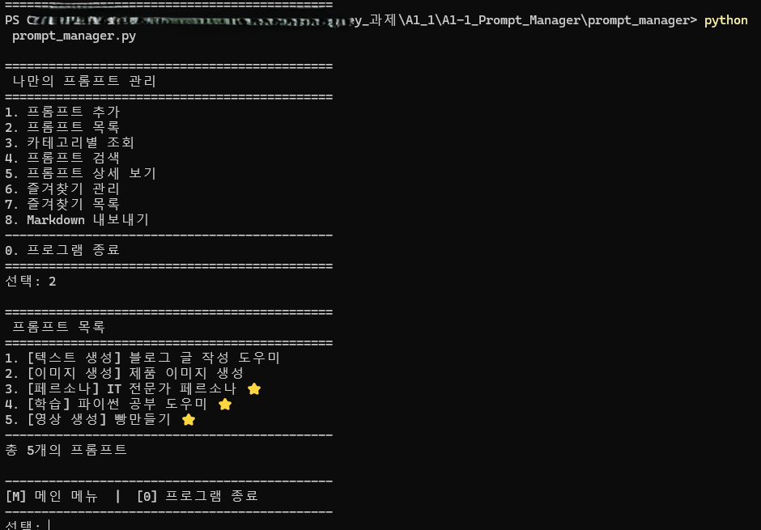

## 저장

```python
def save_prompts():
    with open(DATA_FILE, "w", encoding="utf-8") as file:
        json.dump(
            prompts,
            file,
            ensure_ascii=False,
            indent=2
        )
```

## 불러오기

```python
def load_prompts():
    try:
        with open(DATA_FILE, "r", encoding="utf-8") as file:
            data = json.load(file)

            if isinstance(data, list):
                return data

    except (FileNotFoundError, json.JSONDecodeError):
        pass

    return [prompt.copy() for prompt in DEFAULT_PROMPTS]
```

## JSON을 선택한 이유

현재 Python의 데이터 구조가 `list`와 `dict`이기 때문에 JSON의 배열과 객체 구조로 자연스럽게 변환할 수 있습니다.

또한 Python 기본 라이브러리인 `json`만으로 처리할 수 있고 파일을 직접 열어 내용을 확인할 수도 있어 이 프로젝트 규모에 적합하다고 판단했습니다.

### 동작 흐름

```text
프로그램 실행
    ↓
prompts.json 읽기 시도
    ↓
정상 데이터가 있으면 불러오기
    ↓
파일이 없거나 JSON 오류 발생
    ↓
DEFAULT_PROMPTS 사용
    ↓
프롬프트 추가 / 즐겨찾기 변경
    ↓
prompts.json 저장
```

​

# 13. ⭐ 보너스 과제 1 - Markdown 내보내기

보너스 과제 1의 두 번째 구현으로 전체 프롬프트를 Markdown 파일로 내보내도록 했습니다.

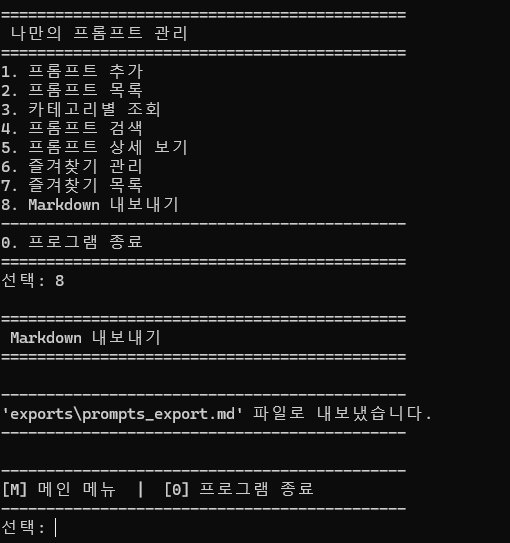

출력 위치:

```text
exports/prompts_export.md
```

`exports` 폴더가 없으면 자동으로 생성합니다.

```python
os.makedirs(export_folder, exist_ok=True)
```

파일은 `"w"` 모드로 열기 때문에 기존 `prompts_export.md`가 있으면 최신 내용으로 덮어씁니다.

내보낼 때는 카테고리별로 프롬프트를 묶어 Markdown 제목 구조로 작성합니다.

​

# 14. 카테고리 확장 설계

기본 카테고리는 한 곳에서 관리합니다.

```python
CATEGORIES = [
    "텍스트 생성",
    "이미지 생성",
    "영상 생성",
    "페르소나",
    "자동화",
    "기타",
    "직접 입력",
]
```

따라서 기본 카테고리 체계를 변경하려면 **CATEGORIES를 수정하는 것이 가장 안전한 시작점**입니다.

또한 사용자가 직접 입력한 카테고리는 `get_available_categories()`에서 기존 프롬프트 데이터를 확인하여 자동으로 추가합니다.

```python
for prompt in prompts:
    if prompt["category"] not in categories:
        categories.append(prompt["category"])
```

이 구조를 사용하여 기본 카테고리와 사용자 생성 카테고리를 함께 조회할 수 있도록 했습니다.

​

# 15. 같은 제목의 프롬프트 처리

현재 구현에서는 **같은 제목의 프롬프트를 허용**합니다.

현재 프로그램에서 실제 항목 선택은 제목 자체가 아니라 **목록 번호**를 이용하기 때문에 같은 제목이 존재해도 각 항목을 선택할 수 있습니다.

```text
1. [텍스트 생성] 제목 A
2. [이미지 생성] 제목 A
```

### 현재 정책의 장점

* 제목을 자유롭게 입력할 수 있음

* 같은 제목이라도 내용과 카테고리가 다른 프롬프트를 저장할 수 있음

### 현재 정책의 단점

동일한 제목이 많아지면 사용자가 어떤 프롬프트인지 구분하기 어려울 수 있습니다.

### 확장한다면

데이터가 많아지는 경우 다음 방식 중 하나로 개선할 수 있습니다.

* 각 프롬프트에 고유 `id` 추가

* 같은 제목 입력 시 경고 표시

* 제목 + 카테고리 조합으로 중복 확인

현재 과제 범위에서는 목록 번호를 통해 항목을 구분하도록 유지했습니다.

​

# 16. Merge Conflict가 발생한다면

이번 `feature/list` 병합에서는 충돌이 발생하지 않았지만, 충돌이 발생한다면 다음 순서로 해결할 수 있습니다.

```text
1. git status
   ↓
2. 충돌이 발생한 파일 확인
   ↓
3. <<<<<<< / ======= / >>>>>>> 구간 확인
   ↓
4. 사용할 코드 선택 또는 두 변경 내용을 직접 통합
   ↓
5. 프로그램 실행 및 기능 검증
   ↓
6. git add <해결한 파일>
   ↓
7. git commit
   ↓
8. git log로 결과 확인
```

중요한 점은 충돌 표시만 제거하는 것이 아니라 **프로그램을 다시 실행하여 기존 기능이 정상적으로 동작하는지 검증한 뒤 커밋하는 것**입니다.

​

# 17. 프로젝트 구조

프로젝트는 저장소 루트에 **과제 문서, Git 설정 파일, README, 스크린샷 폴더**를 두고, 실제 Python 프로그램은 `prompt_manager/` 폴더 안에 분리했습니다.

```text
A1-1_Prompt_Manager/
│
├── .gitignore
│   └── Git으로 추적하지 않을 Python 캐시 등 불필요한 파일 설정
│
├── README.md
│   └── 프로젝트 설명, 구현 내용, 실행 방법, 평가 대비 내용
│
├── A1-1_Python_Git_기초_Git과_함께하는_Python_첫_모듈_정리본.md
│   └── Python / Git 기초 학습 정리 문서
│
├── Python_Git_기초_미션.md
│   └── Python / Git 기초 미션 문서
│
├── 평가기준.txt
│   └── 프로젝트 기능 및 평가 항목 확인용 문서
│
├── screenshot/
│   ├── 01_python_git_vscode_version확인.png
│   ├── 02_git_py_email_name_hello.png
│   ├── 03_vscode_python_확장프로그램확인.png
│   ├── ...
│   ├── 18_git_checkout_feature_list.png
│   ├── 19_git_merge_fast_forward_push.png
│   ├── 20_git_pull.png
│   └── git_log_oneine_graph.png
│       └── 개발 환경, Git/GitHub 과정, 프로그램 실행 증빙 이미지
│
└── prompt_manager/
    │
    ├── prompt_manager.py
    │   └── 프롬프트 관리 프로그램 본체
    │
    ├── prompts.json
    │   └── 프롬프트와 즐겨찾기 상태를 저장하는 JSON 데이터
    │
    └── exports/
        └── prompts_export.md
            └── Markdown 내보내기로 생성되는 프롬프트 문서
```

## 실행 파일과 데이터 파일의 위치

실제 프로그램 관련 파일은 `prompt_manager/` 폴더 안에 모아두었습니다.

```text
prompt_manager/
├── prompt_manager.py
├── prompts.json
└── exports/
    └── prompts_export.md
```

이 구조를 사용하면 과제 설명 문서와 실행 프로그램을 구분할 수 있고, JSON 데이터와 Markdown 출력 결과도 프로그램 파일 가까이에서 함께 관리할 수 있습니다.

​

# 18. 평가 항목 대응 요약

| 평가 항목                           | 구현 / 증빙                          |
| ------------------------------- | -------------------------------- |
| Python 3.10 이상                  | 개발 환경 스크린샷                       |
| Git 버전 / user.name / user.email | Git 설정 스크린샷                      |
| GitHub URL / 코드 업로드             | Repository 및 GitHub 스크린샷         |
| clone 기록                        | `05_git_clone.png`               |
| 프로그램 메뉴 / 번호 선택                 | `08_program_main_menu.png`       |
| 프롬프트 추가 및 목록 반영                 | `09`, `10` 실행 스크린샷               |
| 카테고리별 조회                        | `11_program_category_lookup.png` |
| 제목 또는 내용 검색                     | `12_program_search.png` + 검색 코드  |
| 즐겨찾기 추가 / 해제                    | `14_program_favorite.png`        |
| 브랜치 / 병합 기록                     | `18`, `19`, Git log              |
| README 설명 / 실행 방법               | 본 문서                             |
| 함수 분리                           | 함수 역할 표                          |
| 데이터 구조                          | `list` + `dict` 설계 설명            |
| 입력 검증                           | 빈 값 / 숫자 / 범위 검증 설명              |
| 기능 단위 커밋                        | Git 개발 흐름 설명                     |
| `while` 사용 원리                   | `main()`, `next_action()` 설명     |
| 브랜치 분리 이유                       | `feature/list` 작업 기준 설명          |
| 종료 후 데이터 유지                     | ⭐ JSON 보너스 구현                    |
| 중복 제목 정책                        | 현재는 허용, 목록 번호로 식별                |
| merge conflict 대응               | 해결 → 실행 검증 → 커밋 순서               |
| 카테고리 확장                         | `CATEGORIES` 중심으로 관리             |
| 보너스 문제 해결                       | JSON 영속화 + Markdown 내보내기         |

​

# 19. 프로젝트를 통해 배운 점

이번 프로젝트에서는 Python 문법을 각각 따로 연습하는 것보다 **여러 기능을 하나의 프로그램 안에서 연결하고 상태를 관리하는 과정**을 경험할 수 있었습니다.

특히 다음 내용을 직접 구현하고 설명할 수 있게 되었습니다.

* 리스트와 딕셔너리를 이용한 데이터 모델링

* `while`을 이용한 반복 입력과 프로그램 흐름 제어

* `break`, `continue`, `return`의 역할 차이

* 빈 값 / 숫자 / 범위 입력 검증

* `in`, `or`, `.lower()`를 이용한 검색

* 함수 분리를 통한 코드 책임 구분

* JSON을 이용한 데이터 영속화

* Markdown 파일 자동 생성

* 기능 단위 Git 커밋

* 별도 브랜치에서 기능 개발

* Fast-forward merge

* merge conflict 해결 절차

* GitHub 원격 저장소 관리

최종적으로 단순한 콘솔 메뉴에서 시작해 **데이터 저장과 문서 내보내기까지 가능한 프롬프트 관리 프로그램**으로 확장했습니다.

​

# Repository

**GitHub**

<https://github.com/lgd12345/A1-1_Prompt_Manager>
